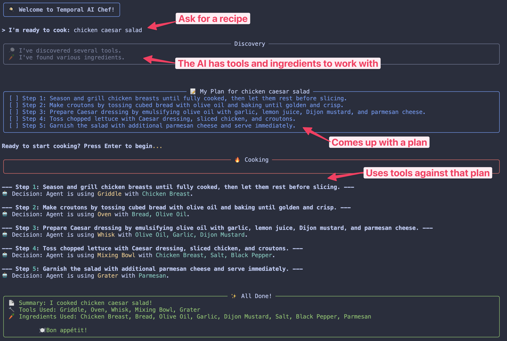

# Temporal AI Chef



A CLI demo application that demonstrates how Temporal workflows can be **deterministic** (reliable execution) but not **pre-determined** (dynamically planned by LLM during execution).

## Value Proposition

Shows how AI can drive business logic while maintaining Temporal's reliability guarantees:
- **Dynamic Planning**: LLM generates cooking steps in real-time
- **Reliable Execution**: Temporal ensures each step completes successfully  
- **Real-time Visibility**: Live progress updates via workflow queries
- **Graceful Degradation**: Works with or without OpenAI API key

## Quick Start

1. **Install dependencies:**
   ```bash
   uv sync
   ```

2. **Set up environment (optional):**
   ```bash
   cp .env.example .env
   # Edit .env with your OpenAI API key for LLM features
   ```

3. **Start Temporal server:**
   ```bash
   temporal server start-dev
   ```

## Running the Application

### Interactive CLI (Recommended for Demos)
```bash
# Terminal 1: Start the worker
uv run chef-worker

# Terminal 2: Run the interactive CLI
uv run temporal-ai-chef
# OR specify recipe upfront: uv run temporal-ai-chef --recipe "Chicken Caesar Salad"
```

### Quick Demo (30 seconds)
```bash
# Complete demo with embedded worker
uv run chef-demo
```

### Automated CLI
```bash
# Run with embedded worker management
uv run chef-auto --recipe "Pasta Carbonara"
```

## Testing & Development

### Core Tests
```bash
# Primary end-to-end demo
uv run chef-demo

# LLM plan generation showcase (4 different recipes)
uv run python temporal_ai_chef/test_different_recipes.py

# Complete workflow test
uv run python temporal_ai_chef/test_complete.py

# Basic workflow functionality
uv run python temporal_ai_chef/test_stage1.py
```

## How It Works

1. **Planning Phase**: LLM generates step-by-step cooking plan (or uses mock fallback)
2. **Execution Phase**: For each step, LLM selects appropriate tool and ingredients
3. **Simulation**: Tool usage is simulated with realistic delays and visual feedback
4. **Real-time Updates**: CLI polls workflow state every 500ms for live progress

### Example Output
```
🍳 Welcome to Temporal AI Chef!

> I'm ready to cook: Chicken Caesar Salad

📝 My Plan for Chicken Caesar Salad
[ ] Step 1: Grill chicken breasts until fully cooked...
[ ] Step 2: Make Caesar dressing by blending garlic...
[ ] Step 3: Prepare croutons by tossing bread cubes...
[ ] Step 4: Toss chopped lettuce with Caesar dressing...

🔥 Cooking

--- Step 1: Grill chicken breasts until fully cooked...
🤖 Decision: Agent is using Oven with Chicken Breast.
✅ Successfully used Oven for: Grill chicken breasts...

✨ All Done!
📄 Summary: I cooked Chicken Caesar Salad!
🔧 Tools Used: Oven, Blender, Mixing Bowl
🍽️ Bon appétit!
```

## Architecture

- **ChefWorkflow**: Orchestrates the 3-phase cooking process with queryable state
- **ChefActivities**: LLM-powered activities with graceful fallback to mocks
- **Real-time CLI**: High-frequency polling for smooth user experience
- **Data**: 20 kitchen tools and 37 ingredients loaded from JSON files

### LLM Integration
- **GPT-4** for plan generation and tool selection
- **Fallback**: Recipe-specific mock plans when API unavailable
- **Quality**: Professional instructions with temperatures, timing, and techniques

## Key Temporal Concepts Demonstrated

✅ **Deterministic but not Pre-determined**: Workflow execution is reliable, but steps are decided dynamically by LLM  
✅ **Real-time State Queries**: CLI shows live progress without affecting workflow execution  
✅ **Activity-Workflow Separation**: Business logic in activities, orchestration in workflows  
✅ **Graceful Error Handling**: LLM failures automatically fall back to mock implementations